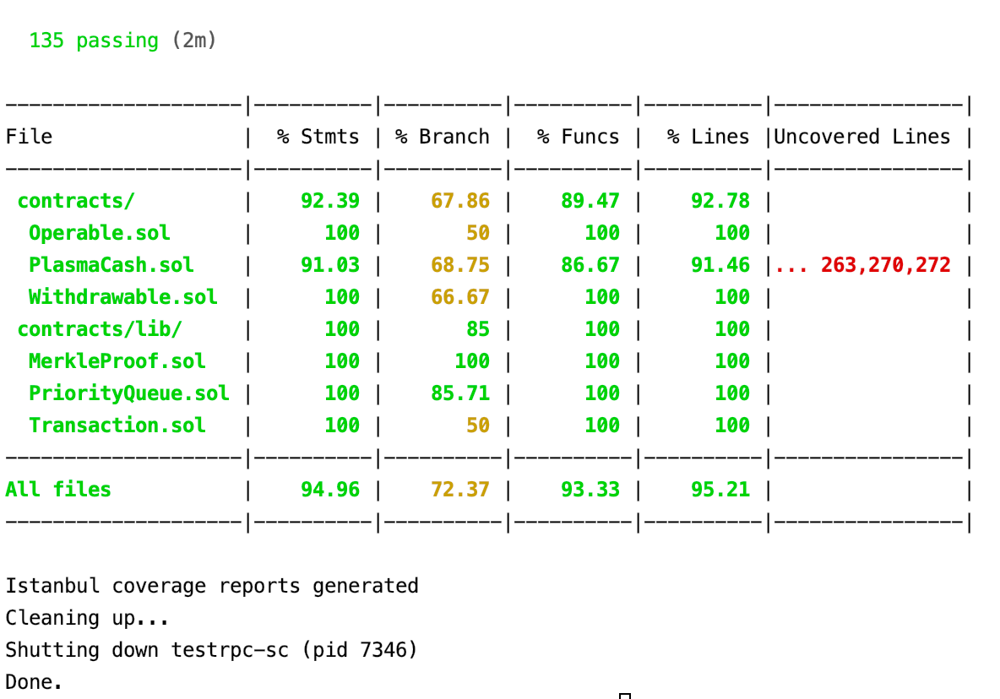
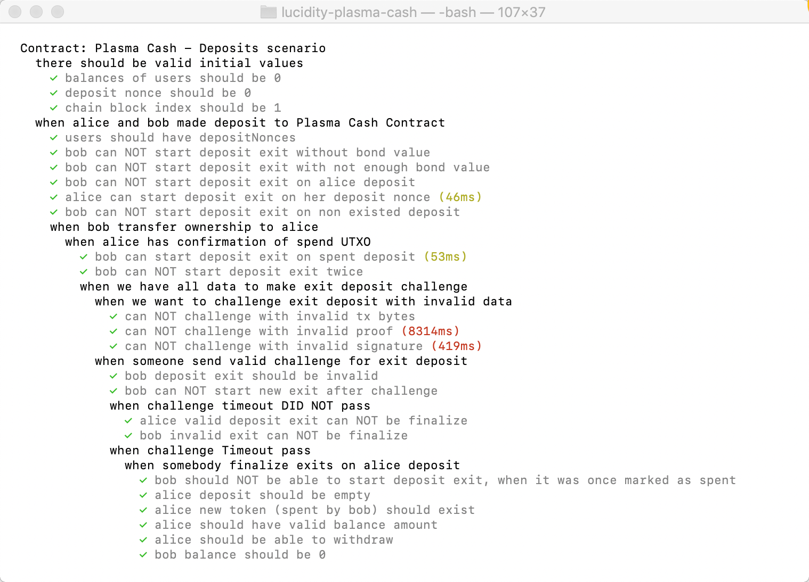
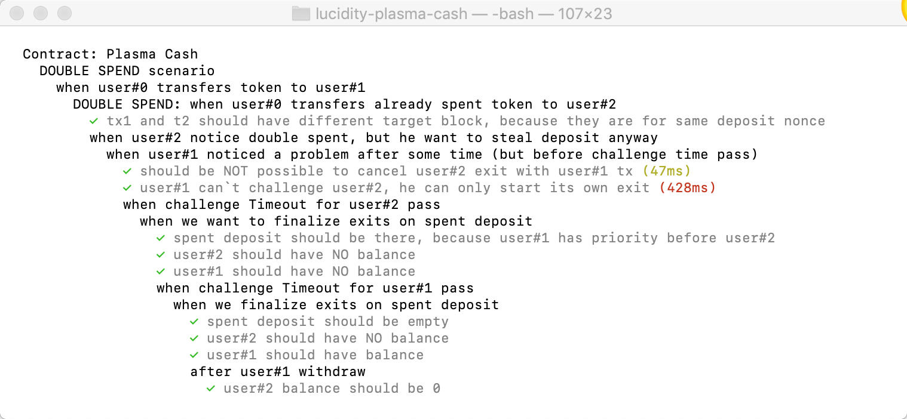
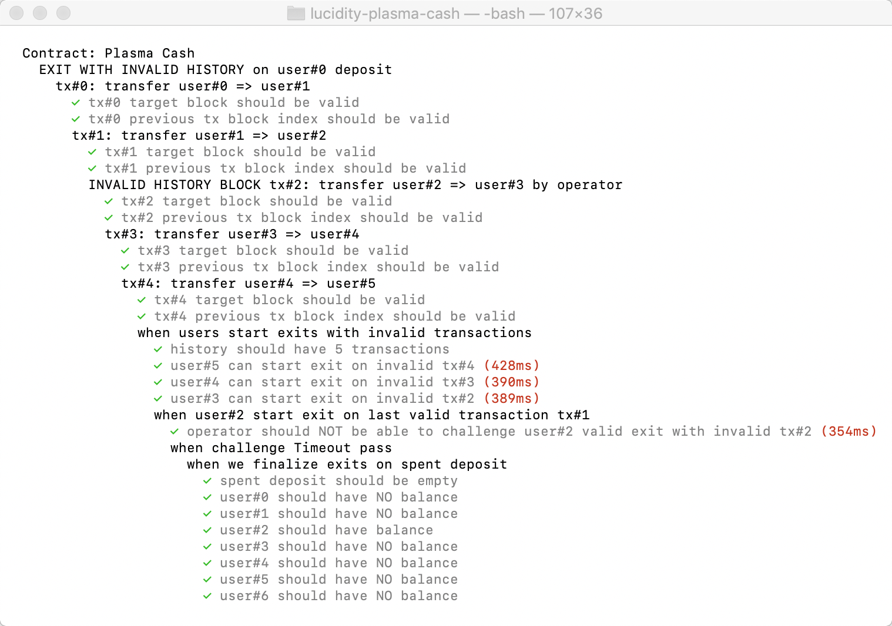
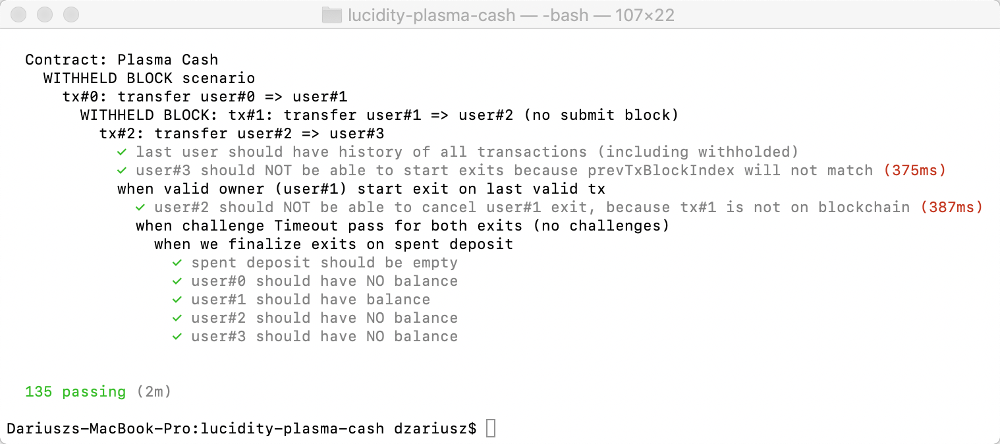

# Lucidity Plasma Cash :collision:

PoC implementation of Plasma Cash. 
Smart contract is written in Solidity for Ethereum. 
Sidechain functionality (plasma user and operator) is written in Javascript.


## Overview

This implementation of plasma cash is a bit different from general specification/guidelines.  
 Main differences:
 - it treats each deposit as individual tree/chain.
 - exits are stored in matrix, where keys are `depositId` and `blockIndex`
   so each exit has its own place.
 - every deposit has its own exit queue
 - priority is not based on exit time, but based on block index
 - challenges uses single transaction instead of two (current and previous)
 - there is no need to reply to challenge
 - you need to finalize exits for each deposit separately

The implementation was tested against below scenarios and all test are done with success:
  * exits on deposit scenario
  * spend scenario
  * double spent scenario
  * invalid block scenario
  * withheld block scenario

## Install

To run this, you will need on your machine: 
- nodejs
- truffle
- ganache-cli

then:

```
$ npm install
$ git hf init
```

## Run tests

**Warning** - there are around 135 tests. 
Tests include delay that is needed for challenge time. 
Because of that, they will take some time - up to several minutes.  
Depend on how fast is your machine, there might be a need to adjust delay time.
Test error message will let you know if you need to set higher delay time or not.
You can do it in `./test/helpers/createScenarioObjects.js`, 
find `challengeTimeoutSec` variable and set valid time.

You can choose different tests to run:

* `truffle test` or `npm run test`
* check for linters errors: `npm run lint`
* With code coverage: `npm run coverage` - 
**IMPORTANT**: turn off local RPC client before run this test.  
Coverage results:


### Issues during tests

* `Error: ENOENT: no such file or directory, open './allFiredEvents'`

If you experience above issue during coverage test, then create file 
`touch ./allFiredEvents` each time before you run test command, it should help.

### Test results

Here you can see results and path for main tests scenarios for plasma cash:

* exits on deposit scenario

* spend scenario

* double spent scenario

* invalid block scenario 

* withheld block scenario

  
You can find files with this tests in `test/scenarios/` directory.

### TODO

- test multiple tx for single submit block
- optimize SparseMerkleTree:  
ie. if we have deposits for #3, #9, #20, then not create merkle tree for all slots, 
instead just for #3..#21.
- make exit bond to be maximum of (exit bond, deposit amount)?
- test if we could optimize storage for history of transactions ie: 
resign from storing empty blocks (where no tx on our deposit was made)
- maybe add max number of exits at one time, 
when finalizing or stop after first valid one?
- add support for tokens (`_currency`)
- try to simplify implementation 
by removing signature/spender check in plasma contract
- test it against invalid `targetBlock`
- get rid of Transaction.checkSig in validateProofSignaturesAndTxData. It's useless because anyone can sign a transaction and we don't provide two tranaction to makes sure prevTxBlockIndex is correct at this point.
- should we use RLP to encode transactions because Transaction struct only uses uint256 and address types

## Licensed under MIT.

This code is licensed under MIT.

Permission is hereby granted, free of charge, to any person obtaining a copy of this software and associated documentation files (the "Software"), to deal in the Software without restriction, including without limitation the rights to use, copy, modify, merge, publish, distribute, sublicense, and/or sell copies of the Software, and to permit persons to whom the Software is furnished to do so, subject to the following conditions:

The above copyright notice and this permission notice shall be included in all copies or substantial portions of the Software.

THE SOFTWARE IS PROVIDED "AS IS", WITHOUT WARRANTY OF ANY KIND, EXPRESS OR IMPLIED, INCLUDING BUT NOT LIMITED TO THE WARRANTIES OF MERCHANTABILITY, FITNESS FOR A PARTICULAR PURPOSE AND NONINFRINGEMENT. IN NO EVENT SHALL THE AUTHORS OR COPYRIGHT HOLDERS BE LIABLE FOR ANY CLAIM, DAMAGES OR OTHER LIABILITY, WHETHER IN AN ACTION OF CONTRACT, TORT OR OTHERWISE, ARISING FROM, OUT OF OR IN CONNECTION WITH THE SOFTWARE OR THE USE OR OTHER DEALINGS IN THE SOFTWARE.

## Notice

Except as contained in this notice, the name of KR8OS shall not be used in advertising or otherwise to promote the sale, use or other dealings in this Software without prior written authorization from KR8OS, Inc.
